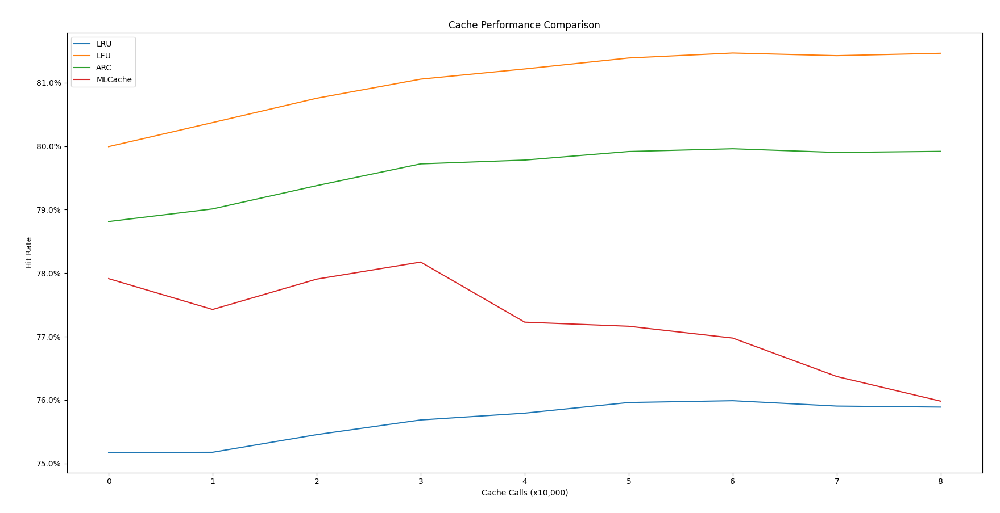
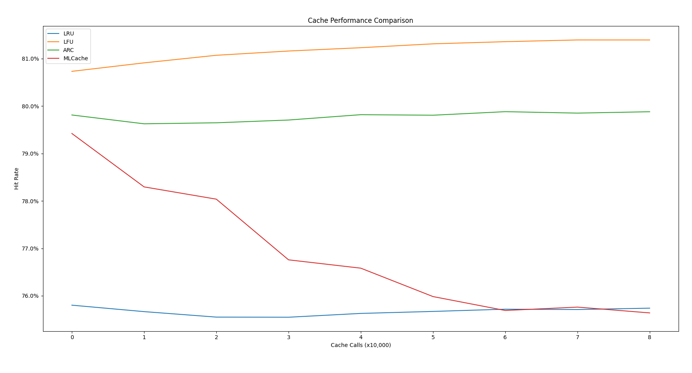
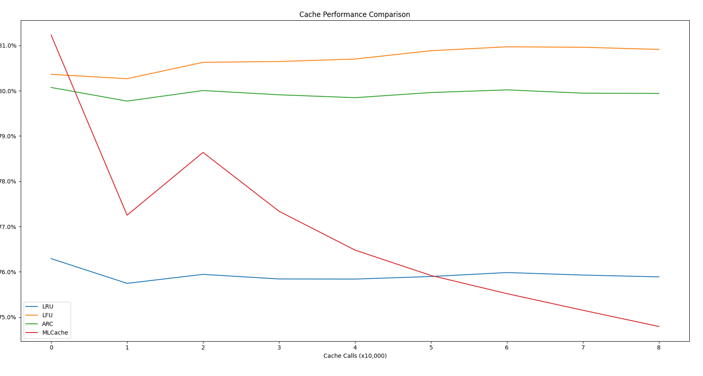

# Machine Learning Cache
A machine learning cache policy, comparing performance against traditional algorithms (LRU, LFU, ARC) under Zipfian workloads using Python and scikit-learn

# Samples:





## run pip install on the following libraries if not present:
numpy
matplotlib
scikit-learn

## running the program
Run: ```python visualize.py```

Will likely take many seconds to finish running since it'll run on your cpu

